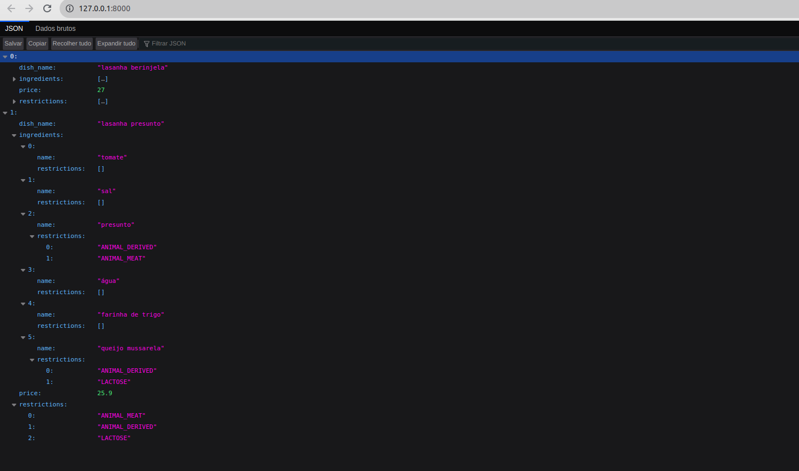

# Python - Restaurant Orders 🍝 (Ferramenta de Construção de Cardápios)
Este projeto consiste na implementação de um programa que permite a um restaurante gerar cardápios de forma simples, levando em consideração restrições alimentares e a disponibilidade dos ingredientes em estoque. A implementação foi baseada na linguagem Python para criar as funções dos arquivos `src/services/menu_data.py`, `src/services/menu_builder.py` e `src/services/inventory_control.py`. Além disso, foi utilizada a ferramenta de testes automatizados, o Pytest, para criar os testes dos módulos `src/models/dish.py` e `src/models/ingredient.py`.

## :heavy_check_mark: Funcionalidades Implementadas
- **Classe MapeadorDePratos:** foi implementada para mapear os pratos e suas respectivas receitas (ingredientes e quantidades) a partir da leitura de um arquivo csv.
- **Classe GeradorDeCardapios:** foi implementada para gerar os cardápios a serem mostrados aos clientes de forma dinâmica, considerando restrições alimentares e a disponibilidade de estoque.
- **Classe GestorDeEstoque:** foi implementada para gerenciar o estoque de ingredientes.

## :hammer: Tecnologias Utilizadas
- Python
- Pytest
- Ambiente Virtual venv

## :computer: Visualize este projeto:


Para executar o projeto, você deve ter o Python instalado em sua máquina. Em seguida, siga os passos abaixo:
- Clone o repositório em sua máquina;
- Crie o ambiente virtual para o exercício: `python3 -m venv .venv && source .venv/bin/activate`
- Instale as dependências: `python3 -m pip install -r dev-requirements.txt`.
- Rode o comando `python3 -m uvicorn app:app` e abra a aplicação em `http://127.0.0.1:8000`

## :mag: Executando os testes:
Utilize o comando no terminal:
```bash
  $ python3 -m pytest
```

## :bulb: Conhecimentos e Habilidades exercitadas:
Hashmaps, estruturas de dados Dict e Set do Python, testes de software, orientação a objetos.
